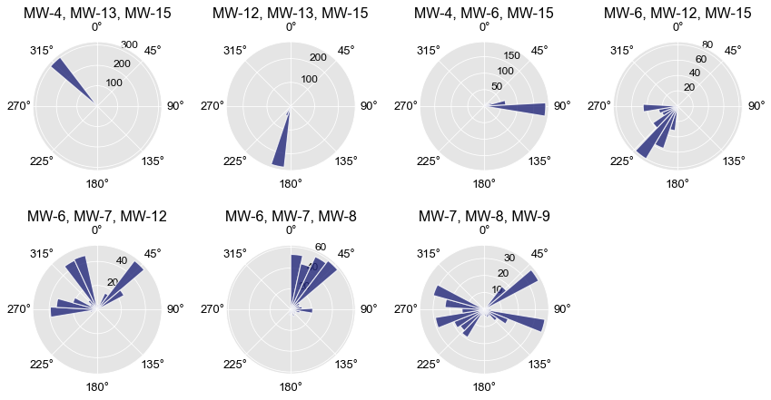

# plane-fitting-gwflow

##  Overview
Computation of groundwater flow gradient and direction using N-point plane fitting solution. Computes true fit for the 3-point problem and a least-squares approximation for 4+ point solutions. 


Points are used to solve or estimate plane equation of the form:


the gradient and direction are then calculated as below.

<b> Gradient </b>


<b> Direction </b>


where theta is degrees from the x-axis, then converted to compass degrees depending on the quadrant

## Uses
<b> Python </b>
- Pandas
- Numpy
- Scipy

## Usage
```
from PlaneFit import PlaneFit

clusters = [
    ["MW-4","MW-13","MW-15"],
    ["MW-12","MW-13","MW-15"],
    ["MW-4","MW-6","MW-15"],
    ["MW-6","MW-12","MW-15"],
]


cd = PlaneFit(
        filepath = 'WellElevations.xlsx',
        locnamecol = 'Location_ID'
        xcol = 'X',
        ycol = 'Y',
        zcol = "Water Elevation",
        tcol = "DateTime",
        clusters = clusters
)

resultsdf = cd.analyzeAllClusters()

```

## Graphed Histogram of GW flow Direction Output Looks like


